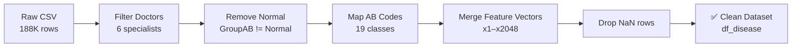

<div align="center">


# 🏥 USAI-Dataset-2026

### Ultrasound AI Dataset — Feature Vector Preparation Pipeline  
*Khon Kaen University · Abdominal Ultrasound · Multi-label Classification*

---

</div>

## 📌 Overview

**USAI-Dataset-2026** is a curated medical imaging dataset pipeline designed for training and evaluating AI/ML models on abdominal ultrasound images. This repository contains the full preparation workflow — from raw data filtering to feature vector extraction — ready for downstream model training.

> 🩺 Data sourced from real clinical ultrasound exams (2013–2023)  
> 🤖 Feature vectors extracted using a pre-trained multi-label model  
> 🏷️ 19 abnormality classes across liver, bile duct, gallbladder, and kidney

---

## 🗂️ Repository Structure

```
USAI-Dataset-2026/
│
├── 📓 USAI10K-Exploring.ipynb               # Main EDA & preparation notebook
├── 📓 Preparation_USAI10K_merge_fv_mlt_nodel.ipynb  # Feature vector merge pipeline
└── 📄 README.md
```

---

## 🔬 Dataset Details

| Property | Value |
|---|---|
| **Source** | USAI Clinical Database 2013–2023 |
| **Total Images** | ~188,209 |
| **Filtered Dataset** | ~107,271 |
| **Feature Dimensions** | x1 – x2048 |
| **Task Type** | Multi-label Classification |
| **Modality** | Abdominal Ultrasound |

---

## 🏷️ Abnormality Classes (19 + Normal)

| Code | Label | Description |
|---|---|---|
| AB01 | MildFattyLiver | Mild fatty liver |
| AB02 | ModerateFattyLiver | Moderate fatty liver |
| AB03 | SevereFattyLiver | Severe fatty liver |
| AB04 | Cirrhosis | Liver cirrhosis |
| AB05 | PDF1 | Parenchymal diffuse finding grade 1 |
| AB06 | PDF2 | Parenchymal diffuse finding grade 2 |
| AB07 | PDF3 | Parenchymal diffuse finding grade 3 |
| AB081 | LiverMass | Single liver mass |
| AB082 | BDD | Bile duct dilatation (common / left / right lobe) |
| AB09 | GallbladderStone | Gallstone |
| AB10 | RenalCyst | Renal cyst |
| AB11 | RenalParenchymalChange | Renal parenchymal change / Renal stone |
| — | Normal | No abnormality detected |

---

## ⚙️ Pipeline Steps



### Step-by-step

1. **Load raw data** — `USAI_Doctor-all_2013-2023_dummy_pathcrop_AB_5FPViT_out241.csv`
2. **Filter specialists** — Select 6 target doctors by doctor code
3. **Exclude Normal cases** — Keep only abnormal findings (`GroupAB != 'Normal'`)
4. **Map disease labels** — Convert `GroupAB` string lists → AB codes
5. **Merge feature vectors** — Join with `fv_usai10k_all_unlearn_mlt_model.csv` on `img_path`
6. **Drop unmatched rows** — Remove rows with `NaN` in feature columns
7. **Export** — Save as `df_disease.csv`

---

## 👩‍⚕️ Contributing Specialists

| Doctor Code | Name |
|---|---|
| 012 | อ.นิตยา |
| 349 | อ.วัลลภ |
| 010 | อ.ผลิญ |
| 465 | อ.ปรารถนา |
| 1816 | อ.วรินทร |
| 844 | พญ.สุภัชชา |

---

## 🚀 Quick Start

```python
import pandas as pd

# Load prepared dataset
df = pd.read_csv('./csv/df_disease.csv')

# Feature vectors
x_cols = [f'x{i}' for i in range(1, 2049)]
X = df[x_cols].values

# Labels
y = df['AB_code'].values

print(f'Dataset shape: {df.shape}')
print(f'Feature matrix: {X.shape}')
```

---

## 📦 Requirements

```bash
pandas
numpy
matplotlib
scikit-learn
```

---

## 📄 License

This dataset is intended for **academic and research use only**.  
Clinical data is anonymized and used under institutional research approval.

---

<div align="center">

**VI-Lab Research Team · Khon Kaen University · 2026**

</div>
