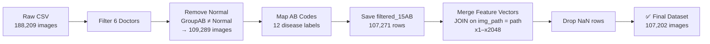

<div align="center">


# 🏥 USAI-Dataset-2026

### Ultrasound AI Dataset — Feature Vector Preparation Pipeline  
*Abdominal Ultrasound · Multi-label Disease Classification · KKU*

---

</div>

## 📌 Overview

**USAI-Dataset-2026** is a curated pipeline for preparing a medical-grade abdominal ultrasound dataset for AI/ML training. Starting from ~188,209 raw ultrasound images annotated by specialist doctors (2013–2023), the pipeline filters, maps disease labels, and merges 2048-dimensional feature vectors extracted from a pre-trained multi-label model — producing a clean, model-ready dataset of **107,202 images**.

---

## 🗂️ Repository Structure

```
USAI-Dataset-2026/
│
├── 📓 USAI10K-Exploring.ipynb
│     └── EDA, doctor filtering, disease mapping, AB code labeling
│
├── 📓 Preparation_USAI10K_merge_fv_mlt_nodel.ipynb
│     └── Merge filtered dataset with feature vectors (x1–x2048)
│
└── 📄 README.md
```

---

## 🔬 Dataset Details

| Property | Value |
|---|---|
| **Raw Images** | 188,209 |
| **After filtering (non-Normal + target doctors)** | 109,289 |
| **After feature vector merge (no NaN)** | **107,202** |
| **Feature Dimensions** | x1 – x2048 |
| **Disease Combination Patterns** | 230+ unique GroupAB patterns |
| **Task Type** | Multi-label Classification |
| **Modality** | Abdominal Ultrasound (B-mode) |
| **Period** | 2013 – 2023 |

---

## 🗃️ Key Files

| File | Description | Primary Key |
|---|---|---|
| `USAI_Doctor-all_2013-2023_dummy_pathcrop_AB.csv` | Raw annotated dataset | `img_path` |
| `USAI_Doctor-all_2013-2023_filtered_15AB_107271.csv` | Filtered with AB codes | `img_path` |
| `fv_usai10k_all_unlearn_mlt_model.csv` | Feature vectors (x1–x2048) | `path` |
| `USAI_Doctor-all_2013-2023_filtered_15AB_fv_usai10k_all_unlearn_mlt_model_107202.csv` | **Final merged dataset** | `img_path` |

---

## 🏷️ Disease Label Mapping (GroupAB → AB Code)

| AB Code | Label | GroupAB value |
|---|---|---|
| AB01 | MildFattyLiver | `Mild fatty liver` |
| AB02 | ModerateFattyLiver | `Moderate fatty liver` |
| AB03 | SevereFattyLiver | `Severe fatty liver` |
| AB04 | Cirrhosis | `Cirrhosis` |
| AB05 | PDF1 | `PDF 1` |
| AB06 | PDF2 | `PDF 2` |
| AB07 | PDF3 | `PDF 3` |
| AB081 | LiverMass | `Single Mass` |
| AB082 | BDD | `BileDuct_Common bile duct`, `BileDuct_Right lobe`, `BileDuct_Left lobe` |
| AB09 | GallbladderStone | `Gallstone` |
| AB10 | RenalCyst | `Renal cyst` |
| AB11 | RenalParenchymalChange / RenalStone | `Parenchymal change`, `Kidney_Parenchymal change`, `Renal stone` |

> ℹ️ Each case can have **1–4 diseases** simultaneously.  
> `GroupAB` stores a Python list string (e.g. `"['Mild fatty liver', 'Renal cyst']"`) — use `ast.literal_eval()` to parse.

---

## 👩‍⚕️ Target Specialist Doctors (6 doctors)

| Doctor Code | Name |
|---|---|
| 012 | อ.นิตยา |
| 349 | อ.วัลลภ |
| 010 | อ.ผลิญ |
| 465 | อ.ปรารถนา |
| 1816 | อ.วรินทร |
| 844 | พญ.สุภัชชา |

---

## ⚙️ Pipeline



### Step-by-step

**Notebook 1 — `USAI10K-Exploring.ipynb`**

```python
import pandas as pd, ast

# 1. Load raw data
usai10k = pd.read_csv('./csv/USAI_Doctor-all_2013-2023_dummy_pathcrop_AB.csv')
usai10k = usai10k.loc[:, ~usai10k.columns.str.contains('^Unnamed')]
# shape: (188209, 46)

# 2. Filter 6 target doctors
doctor_codes = [12, 349, 10, 465, 1816, 844]
df_filtered = usai10k[usai10k['Doctor'].isin(doctor_codes)].copy()

# 3. Remove Normal cases
df_filtered = df_filtered[df_filtered['GroupAB'] != 'Normal'].copy()
# → 109,289 rows, 230+ disease patterns

# 4. Map disease labels to AB codes
disease_map = {
    'Mild fatty liver': 'AB01', 'Moderate fatty liver': 'AB02',
    'Severe fatty liver': 'AB03', 'Cirrhosis': 'AB04',
    'PDF 1': 'AB05', 'PDF 2': 'AB06', 'PDF 3': 'AB07',
    'Single Mass': 'AB081',
    'BileDuct_Common bile duct': 'AB082', 'BileDuct_Right lobe': 'AB082',
    'BileDuct_Left lobe': 'AB082', 'Gallstone': 'AB09',
    'Renal cyst': 'AB10', 'Parenchymal change': 'AB11',
    'Kidney_Parenchymal change': 'AB11', 'Renal stone': 'AB11',
}

def parse_group(val):
    try: return ast.literal_eval(val)
    except: return [val]

def map_group_to_ab(val):
    codes = list(dict.fromkeys(disease_map[d] for d in parse_group(val) if d in disease_map))
    return codes if len(codes) > 1 else codes[0] if codes else None

df_disease = df_filtered[df_filtered['GroupAB'].apply(
    lambda v: any(d in disease_map for d in parse_group(v))
)].copy()
df_disease['AB_code'] = df_disease['GroupAB'].apply(map_group_to_ab)

# 5. Save
df_disease.to_csv('./csv/USAI_Doctor-all_2013-2023_filtered_15AB_107271.csv', index=False)
```

**Notebook 2 — `Preparation_USAI10K_merge_fv_mlt_nodel.ipynb`**

```python
# 6. Load filtered dataset + feature vectors
filtered_15AB = pd.read_csv('./csv/USAI_Doctor-all_2013-2023_filtered_15AB_107271.csv')
fv_usai10k_all = pd.read_csv('./csv/fv_usai10k_all_unlearn_mlt_model.csv')
fv_usai10k_all = fv_usai10k_all.loc[:, ~fv_usai10k_all.columns.str.contains('^Unnamed')]

# 7. Merge on img_path = path (keep x1–x2048 only)
x_cols = [f'x{i}' for i in range(1, 2049)]
merged = filtered_15AB.merge(
    fv_usai10k_all[['path'] + x_cols],
    left_on='img_path', right_on='path', how='left'
)

# 8. Drop unmatched rows (NaN in feature columns)
merged_clean = merged.dropna(subset=['x1']).copy()
# → 107,202 rows

# 9. Save final dataset
merged_clean.to_csv(
    './csv/USAI_Doctor-all_2013-2023_filtered_15AB_fv_usai10k_all_unlearn_mlt_model_107202.csv',
    index=False
)
```

---

## 🚀 Quick Start

```python
import pandas as pd

df = pd.read_csv('./csv/USAI_Doctor-all_2013-2023_filtered_15AB_fv_usai10k_all_unlearn_mlt_model_107202.csv')

x_cols = [f'x{i}' for i in range(1, 2049)]
X = df[x_cols].values        # Feature matrix: (107202, 2048)
y = df['AB_code'].values     # Labels

print(f'Dataset : {df.shape}')
print(f'Features: {X.shape}')
print(f'Labels  :\n{df["AB_code"].value_counts()}')
```

---

## 📦 Requirements

```bash
pip install pandas numpy matplotlib scikit-learn
```

---

## 📄 License

This dataset is for **academic and research use only**.  
Clinical data is anonymized under institutional research approval.

---

<div align="center">

**VI-LAB Research Team · Khon Kaen University · 2026**

</div>
